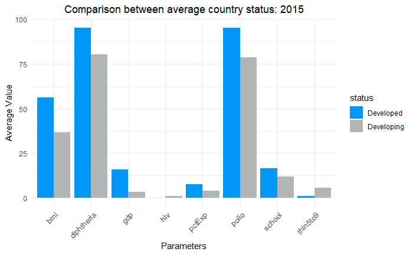
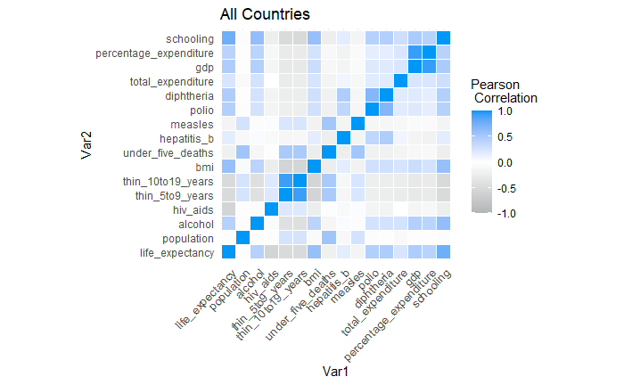
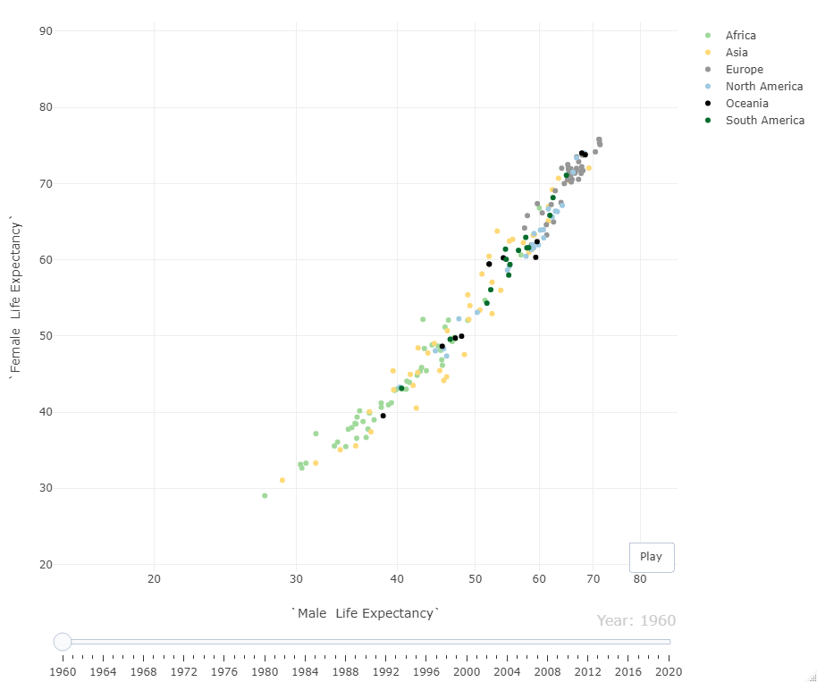

# Life Expectancy Project

This was a project trying to gain more information on life expectancy within the world based on whether a nation-state was considered, by the United Nations, to be developed or developing. Data was extracted from the World Health Organization and processed. The following are some of this projects highlights.

# Field Comparison between Developed and Developing

# Heatmap for inference of correaltion

# Comparison Interactivity

